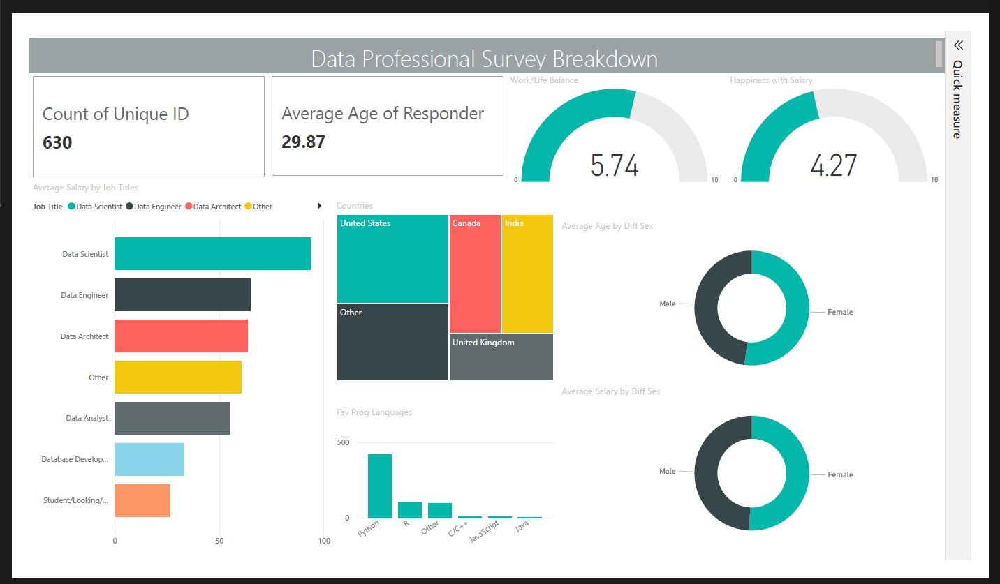

# 📊 Data Professional Survey Dashboard — Power BI

An interactive Power BI dashboard built using a real-world survey of **630 data professionals**, designed to explore salary trends, work-life balance, demographics, and programming language preferences across different data-related roles.

---

## 📸 Dashboard Preview



---

# 📁 Project Structure

```text
data-professional-survey-dashboard/
│
├── Data_Professional_Survey_Dashboard.pbix
├── Power_BI_-_Final_Project.xlsx
├── README.md
│
└── assets/
    └── dashboard-preview.png
```

---

# 🔍 About the Dataset

This dataset contains survey responses collected from professionals working in the data industry.

### Dataset Includes:
- Job Titles
- Salary Information
- Country
- Favourite Programming Language
- Work/Life Balance Rating
- Salary Satisfaction
- Age
- Gender
- Education Background
- Career Transition Information

### Total Respondents:
- **630 unique participants**

---

# 📈 Dashboard Features

### ✅ KPI Cards
- Total Respondents
- Average Age of Respondents

### ✅ Salary Analysis
- Average Salary by Job Title

### ✅ Country Distribution
- Treemap visualization of respondents by country

### ✅ Satisfaction Metrics
- Work/Life Balance Score
- Happiness with Salary

### ✅ Demographic Analysis
- Average Age by Gender
- Average Salary by Gender

### ✅ Programming Language Insights
- Favourite programming languages among respondents

---

# 🛠️ Tools & Technologies Used

| Tool | Purpose |
|---|---|
| Power BI Desktop | Dashboard creation & visualization |
| Power Query | Data cleaning & transformation |
| DAX | Calculated measures & KPIs |
| Excel | Source dataset |

---

# 🔧 Data Cleaning & Transformation

Performed using **Power Query**:

- Removed unnecessary columns
- Cleaned and standardized job titles
- Grouped country values into consistent categories
- Converted salary ranges into numerical averages
- Prepared data for dashboard visualization

---

# 💡 Key Insights

- **Data Scientists** reported the highest average salaries
- **Python** is the most preferred programming language
- **Work/Life Balance (5.74/10)** is rated higher than **Salary Satisfaction (4.27/10)**
- The **United States** contributed the largest number of survey responses
- Average respondent age is approximately **30 years**

---

# 🚀 How to Use

1. Download or clone this repository
2. Install Power BI Desktop
3. Open:

```text
Data_Professional_Survey_Dashboard.pbix
```

4. Explore the interactive dashboard

---

# 👤 Author

Created as a portfolio project to demonstrate:
- Data Visualization
- Dashboard Design
- Business Intelligence Concepts
- Power BI Development
- Analytical Storytelling

---

# 📄 License

This project is intended for educational and portfolio purposes only.